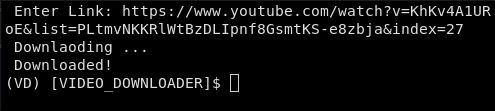

# Video_Downloader
A little YouTube videos downloader.

### Requirements:

 -Pytube. 

### Install requirements:

 $ pip install pytube 

### How to use:

 You just need to put the link of the video. When the video has been downloaded, it will appear in your download directory.

 

